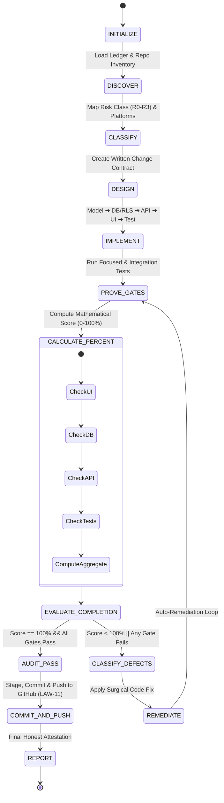

<!-- UniERP-Enterprise-SAAS-Flow: 1.0.0 -->
# Enterprise SAAS Execution Flow: State Machine & Auto-Remediation Loop

This document formally defines the state machine and transition rules governing autonomous agent cycles across all 31 repositories in the UniERP polyrepo.

---

## 🔄 The Autonomous Execution State Machine

---

## 🚦 State Definitions & Transition Rules

### 1. `INITIALIZE`
* Read `.agents/rules/ENTERPRISE_SAAS_RULES.md` and `.agents/memory/ENTERPRISE_SAAS_EXECUTION_LEDGER.json`.
* Verify environment dependencies (Node.js >= 22, pnpm, PostgreSQL connection string).

### 2. `DISCOVER`
* Inspect current Git status, branch, and diffs across affected repositories.
* Search existing models, endpoints, and components before proposing new abstractions.

### 3. `CLASSIFY`
* Determine Risk Class:
  * **R0 (Advisory)**: Pure analysis, no mutations.
  * **R1 (Local)**: Single repo changes, non-breaking.
  * **R2 (Coordinated)**: Multi-repo changes across L0–L5. Requires written Change Contract.
  * **R3 (Restricted)**: Production mutation, destructive migrations, secret rotation. **Requires explicit human authorization.**

### 4. `DESIGN`
* Draft change contract in `contracts`. Update OpenAPI/Zod specs and ADRs before touching implementation.

### 5. `IMPLEMENT`
* Execute changes sequentially through the 7-phase delivery pipeline (L0 Contracts ➔ L2 Data/RLS ➔ L3 API ➔ L1/L4/L5 UI & Apps ➔ Tests).

### 6. `PROVE_GATES`
* Execute boundary checks:
  * TypeScript compilation (`pnpm typecheck`)
  * Vitest + vitest-axe a11y tests (`pnpm test`)
  * PostgreSQL RLS 4-part isolation assertions with `NOBYPASSRLS` role
  * Strata DL 2.0 token checks (`check-tokens.mjs`)

### 7. `CALCULATE_PERCENT`
* Execute `run-enterprise-saas-engine.mjs`.
* Deterministically compute:
  $$\text{Score} = (0.25 \times \text{UI}) + (0.25 \times \text{DB}) + (0.25 \times \text{API}) + (0.25 \times \text{Test})$$

### 8. `EVALUATE_COMPLETION` & `REMEDIATE` Loop
* **Rule**: If score < 100% or any required gate fails, **DO NOT STOP OR MOCK PASS**.
* Transition directly to `CLASSIFY_DEFECTS`.
* Extract exact failing assertion lines from compiler or test runner output.
* Apply targeted fix in source code.
* Loop back to `PROVE_GATES`.
* Repeat until score reaches 100% or an R3 restricted human authorization is required.

### 9. `COMMIT_AND_PUSH` (Mandatory LAW-11)
* Scan all 31 repositories for modified files (`git status --porcelain`).
* In each modified repository, run `git add -A`.
* Commit with conventional semantic message: `feat(enterprise-saas): ...` or `fix(enterprise-saas): ...`.
* Push to upstream GitHub remote: `git push origin <branch>`.
* Record the commit hash and push confirmation in the execution ledger.

### 10. `REPORT`
* Output honest cycle status using strict vocabulary: `DONE`, `PARTIAL`, `BLOCKED`, or `FAILED`.
* Never declare `DONE` if score < 100%, any check was skipped/unverified, or changes remain unpushed to GitHub.
