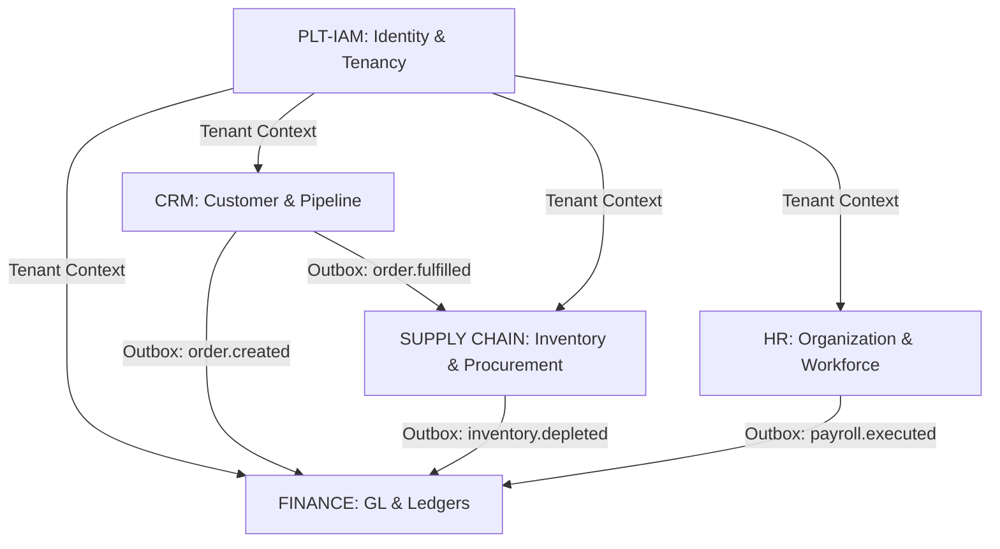

# Canonical Enterprise Domain Catalog & Bounded Contexts

This document formalizes the canonical bounded contexts, aggregate roots, domain ownership, and System of Record (SoR) translations across the active UniERP estate per [FND-P1-001](../../governance/change-contracts/FND-P1-001-canonical-domain-catalog.md).

---

## 1. Domain Topology & Bounded Contexts

UniERP operates as a federated modular monolith with strict domain boundaries enforced at compile-time and runtime. Direct cross-module database access or relative source imports between modules (`api/src/modules/<A>` to `api/src/modules/<B>`) are prohibited. All cross-boundary interaction occurs strictly through the asynchronous transactional outbox or versioned public contracts in `@kannan19302/contracts`.

---

## 2. Canonical Business Domains & Aggregate Roots

### A. Finance & Accounting (`finance`)
- **System of Record (SoR)**: General Ledger, Chart of Accounts, Journal Entries, Tax Calculations, Multi-Currency Reconciliations.
- **Primary Aggregate Roots**:
  - `JournalEntry`: Implements immutable double-entry bookkeeping ($TotalDebits = TotalCredits$). Once posted, records cannot be updated or deleted; reversing entries must be applied.
  - `FiscalPeriod`: Controls accounting period opening, closing, and year-end close locks.
  - `TaxRule`: Declarative tax calculation engine supporting regional VAT, GST, and sales taxes.
- **Cross-Boundary Invariants**:
  - Other modules (Sales, Procurement, HR) MUST NOT write to GL tables directly; they publish outbox events (`sales.invoice.approved`, `procurement.bill.received`, `hr.payroll.settled`) consumed by the Finance event handler.

### B. Sales & Commerce (`sales`, `crm`)
- **System of Record (SoR)**: Opportunities, Quotes, Sales Orders, Customer Accounts, Price Books.
- **Primary Aggregate Roots**:
  - `SalesOrder`: Manages the lifecycle from draft $\to$ confirmed $\to$ fulfilled $\to$ invoiced $\to$ closed.
  - `CustomerAccount`: Encapsulates credit limits, billing terms, and customer contacts.
  - `PriceBook`: Versioned catalog pricing with tenant-specific price tier overlays.
- **Cross-Boundary Invariants**:
  - Order confirmation reserves inventory via an asynchronous reservation command to Supply Chain; fulfillment updates GL accounts receivable.

### C. Inventory & Supply Chain (`inventory`, `supply-chain`, `procurement`)
- **System of Record (SoR)**: Warehouses, Stock Locations, Inventory Items, Serial/Batch Tracking, Purchase Orders, Receipts.
- **Primary Aggregate Roots**:
  - `StockItem`: Master inventory item definition with valuation method (FIFO, LIFO, Weighted Average).
  - `StockLedgerEntry`: Immutable inventory transaction log tracking movement between bins and warehouses.
  - `PurchaseOrder`: External vendor procurement contract with 3-way matching (PO $\to$ Goods Receipt $\to$ Vendor Invoice).
- **Cross-Boundary Invariants**:
  - Stock levels cannot become negative unless explicitly configured with back-order entitlement. Every inventory adjustment emits a financial impact event.

### D. Human Resources & Workforce (`hr`, `payroll`)
- **System of Record (SoR)**: Employees, Organizational Hierarchy, Positions, Leave Allocations, Compensation Structures.
- **Primary Aggregate Roots**:
  - `Employee`: Master personnel record containing identity linkage, department hierarchy, and job profile.
  - `PayrollRun`: Batch wage calculation and statutory deduction processing.
  - `LeaveRequest`: Absence approval workflow with balance decrement invariants.
- **Cross-Boundary Invariants**:
  - PII data fields (SSN, national identifiers, salary figures) are encrypted at rest with field-level AES-256-GCM envelope encryption.

### E. Foundation & SaaS Control Plane (`admin`, `saas`, `platform`)
- **System of Record (SoR)**: Tenants, Organizations, Subscriptions, Feature Flags, Quotas, System Audit Logs.
- **Primary Aggregate Roots**:
  - `Tenant`: Top-level legal boundary partition. All business entities carry a mandatory `tenantId` foreign key enforced by PostgreSQL RLS with `NOBYPASSRLS`.
  - `Subscription`: Commercial licensing tier, active module entitlements, and metered usage caps.
  - `OutboxEvent`: High-performance transactional event log guaranteeing at-least-once message publication.

---

## 3. System of Record (SoR) Matrix & Cross-Domain Translations

| Data Entity / Concept | Authoritative SoR Module | Downstream Consumers | Translation & Invariant Mechanism |
| :--- | :--- | :--- | :--- |
| **Customer Master** | `crm` | `sales`, `finance`, `support` | CRM owns customer lifecycle; Finance maintains customer accounting ledger. |
| **Vendor Master** | `procurement` | `finance`, `inventory` | Procurement validates compliance; Finance holds payment terms and bank routing. |
| **Item Master** | `inventory` | `sales`, `procurement`, `manufacturing` | Inventory owns SKU, dimensions, valuation; Sales attaches pricing overlays. |
| **User & Membership** | `idp` / `auth` | All 33 business modules | IdP owns credentials and OIDC sessions; Admin module binds users to tenant roles. |
| **Chart of Accounts** | `finance` | `sales`, `procurement`, `payroll` | Read-only dimensional references in operational modules; posting validated in Finance. |
| **Exchange Rates** | `finance` | `sales`, `procurement` | Daily rate snapshots pegged at transaction timestamp for tax and ledger immutability. |

---

## 4. Architectural Invariant Governance

1. **Transaction Atomicity**: Business mutations and resulting domain events MUST be committed in a single atomic database transaction using the Transactional Outbox pattern.
2. **Tenant Isolation**: Every aggregate query MUST include the current session's `tenantId`, verified by PostgreSQL Row-Level Security (`NOBYPASSRLS`).
3. **Optimistic Locking**: Concurrent entity updates MUST verify version tokens (`version` or `updatedAt`) to prevent lost updates in distributed workflows.
4. **Idempotent Handlers**: All event consumers MUST maintain processed event deduplication caches to guarantee idempotency under at-least-once redelivery.
